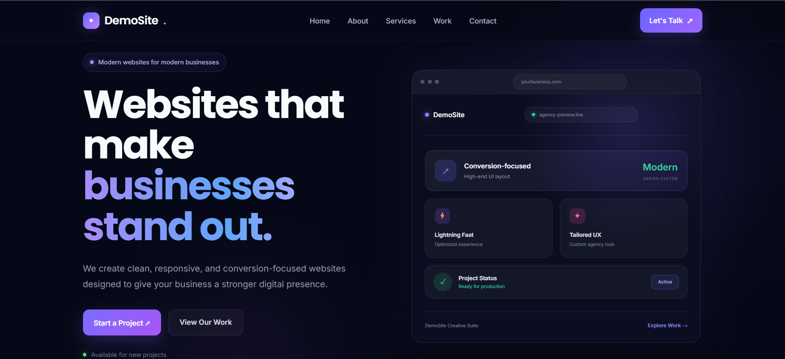
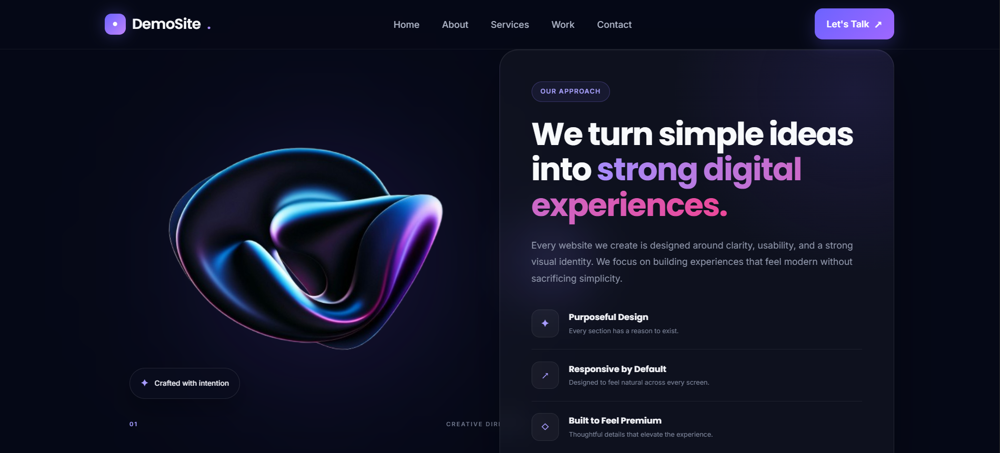
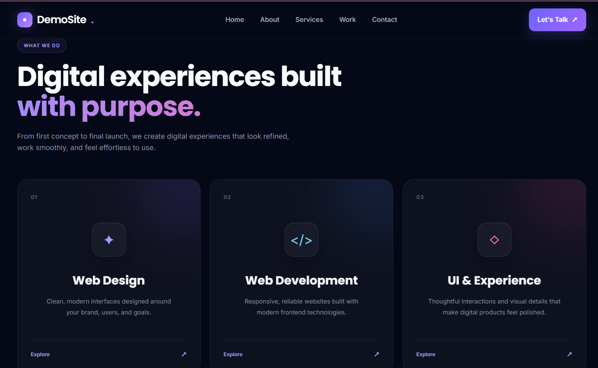
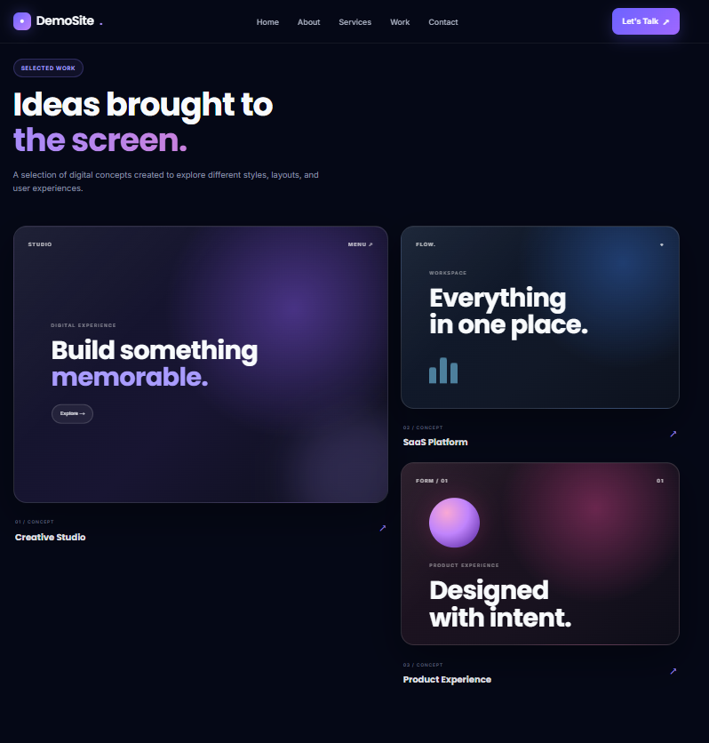
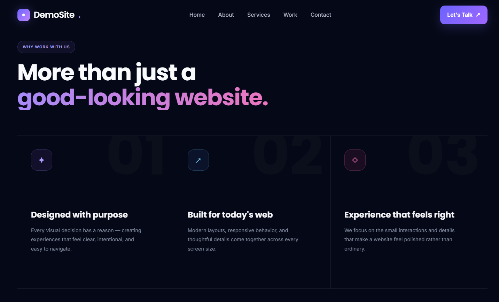
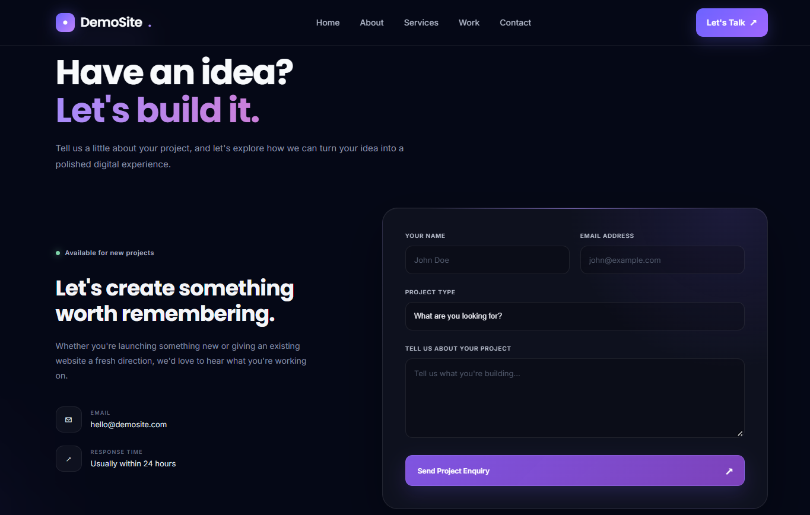

# DemoSite — Modern Business Website

A modern, responsive business website concept built with **HTML, CSS, and JavaScript**.

DemoSite is a frontend project designed to showcase a premium digital presence for a modern business or creative agency. The design focuses on clean layouts, glassmorphism, subtle gradients, responsive interactions, and a polished user experience across desktop and mobile devices.

## 🌐 Live Demo

[View Live Website](https://vinitha3031.github.io/single-page-website/)

## ✨ Features

- Modern dark agency-style UI
- Fully responsive design
- Smooth navigation between sections
- Interactive 3D hero mockup
- Glassmorphism-inspired cards
- Subtle gradients and glow effects
- Responsive mobile navigation
- Modular CSS structure
- Interactive contact form
- Dedicated project showcase section
- Mobile-optimized layouts
- Clean and reusable frontend structure

## 🛠️ Technologies Used

- **HTML5** — Semantic page structure
- **CSS3** — Styling, animations, responsive layouts and visual effects
- **JavaScript** — Interactions, navigation and form behavior

## 🎨 Design Highlights

### Hero Section
A bold landing section with a modern headline, call-to-action buttons, glowing background effects, and an interactive 3D website mockup.

### About Section
A layered visual composition combining an abstract 3D visual with a glass-style content card.

### Services
Three focused service cards presenting the main capabilities of the business.

### Work / Showcase
A visual project showcase designed to present selected work in a modern editorial layout.

### Why Work With Us
A numbered feature section highlighting the key qualities and approach of the business.

### Contact
A two-column contact area with project information, contact details, and a responsive project enquiry form.

## 📸 Screenshots

### Home



### About



### Services



### Work



### Why Work With Us



### Contact



## 📂 Project Structure

```text
single-page-website/
│
├── index.html
├── script.js
│
├── css/
│   ├── style.css
│   ├── services.css
│   ├── showcase.css
│   ├── why-chooseus.css
│   ├── contact.css
│   └── footer.css
│
├── screenshots/
│   ├── Home.png
│   ├── about.png
│   ├── services.png
│   ├── work.png
│   ├── why-us.png
│   └── contact.png
│
├── images/
│
├── about1.png
├── about-visual.png
│
└── README.md
````

## 🚀 Getting Started

No frameworks, packages, or additional dependencies are required.

### Run Locally

1. Clone the repository:

```bash
git clone https://github.com/vinitha3031/single-page-website.git
```

2. Open the project folder.

3. Open `index.html` in your browser.

That's it.

## 📱 Responsive Design

The website is designed to work across different screen sizes, including:

* Desktop
* Laptop
* Tablet
* Mobile

Layouts, typography, navigation, cards, forms, and visual elements are adjusted for smaller screens.

## 💡 Project Purpose

This project was created as a **frontend design and development showcase** to demonstrate skills in:

* Responsive web design
* Modern UI development
* CSS layout systems
* Component-style CSS organization
* JavaScript interactions
* Visual hierarchy
* User-focused interface design

## 👩‍💻 Author

**Vinitha G**

GitHub: [@vinitha3031](https://github.com/vinitha3031)

---

⭐ If you like the project, feel free to star the repository.


